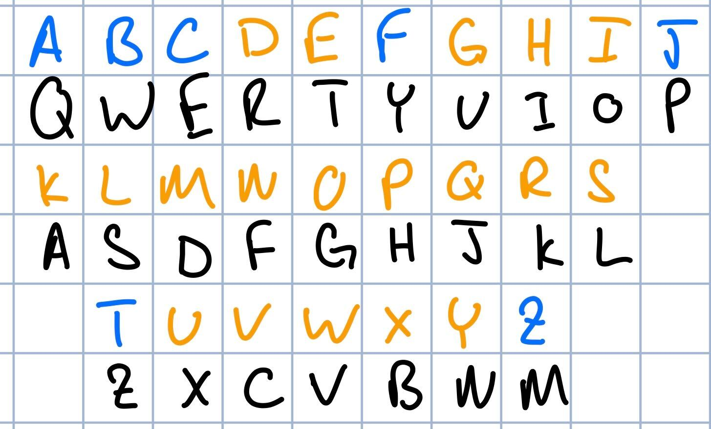

## Challenge: Typewriter
## Category: Crypto

### Prompt:
> Written by jpes707 Oh no! I thought I typed down the correct flag for this problem on my typewriter, but it came out all jumbled on the paper. Someone must have switched the inner hammers around! According to the paper, the flag is zpezy{ktr_gkqfut_hxkhst_tyukokkgotyt_hoftqhhst_ykxoz_qxilrtxiyf}.

### Hint: 
> a becomes q, b becomes w, c becomes e, f becomes y, j becomes p, t becomes z, and z becomes m. Do you see the pattern?

### Solution:
Given a->q, b->w, and c->e, I noticed it looked like the QWERTY keyboard layout in alphabetical order, so I mapped it out by hand.

In the image, black is the standard QWERTY layout, blue is the given transformations, and orange is me filling in the blanks with the rest of the alphabet.

Using this image as a key, `zpezy{ktr_gkqfut_hxkhst_tyukokkgotyt_hoftqhhst_ykxoz_qxilrtxiyf}` maps into `tjctf{red_orange_purple_efgrirroiefe_pineapple_fruit_auhsdeuhfn}`

### Flag:
tjctf{red_orange_purple_efgrirroiefe_pineapple_fruit_auhsdeuhfn}
