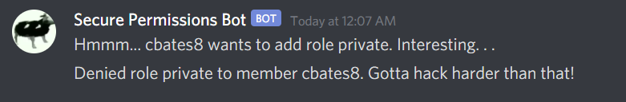

## Challenge: Electric-Bovine
## Category: MISC

### Prompt:
> Do androids dream of electric bovine? Find out on my new Discord server!

### Solution:
Upon joining the discord server, I got a DM from "Secure Permissions Bot." After sending `!help`, the bot responds with this message:
```
Help Menu
-------------
 - !help    Displays this message.
 - !ping    Pong??
 - !about    Displays information about this bot.
 - !resource    Links you to a random resource.
 - !cowsay <text>    Displays your text in cowsay format. Requires greater permissions than user in the guild to use.
 - !list_users     Lists all users in channel.
 - !send_msg <text>    (when used from DMs) sends a message in the #botspam channel in the guild.
 - !role_add <user> <role>    Attempt to add role to user. May only be used from within guild.
> !about
About Me
----------
I'm a bot. On the weekends, I'm a huge fan.
My name is Secure Permissions Bot#7351
You may find my source code here:https://beav.es/o7y
You may find my bot token here https://beav.es/o7r
License: None.
```

From the [source code](https://github.com/cbates8/CTF-Writeups/blob/main/damCTF%202020/MISC%20-%20Electric-Bovine/bot_source.py) I can see that I can use `!send_msg` to in turn use `!add_role`. Sending `!send_msg !role_add xxx622925433796689920x xxx763128087226351638x` returns this message:



I needed to reverse engineer authenticate() in the source code to figure out why it is returning False instead of True. I determined the problem area was in:

```python
permset = list(
	(set(author_credentials) & set(authorizer_credentials)) & set(role_information)
)
```

I found that his statement checks if these sets all have at least one entry in common. Looking at the current values, I saw that changing my nickname in the server to 768341608578486851 would make the statement evaluate to true, allowing me to run `!send_msg !role_add xxx622925433796689920x xxx763128087226351638x` and to give myself elevated permissons in the server.

![Role_add success(role_add_success.png)

Now that I had the "private" role, I could invoke the `!cowsay` command. After some trial and error, sending `!cowsay <flag` had the Secure Permisson's Bot respond with the flag:

```
 __________________________
< dam{discord_su_do_speen} >
 --------------------------
        \   ^__^
         \  (oo)\_______
            (__)\       )\/\
                ||----w |
                ||     ||
```

### Flag:
dam{discord_su_do_speen}
